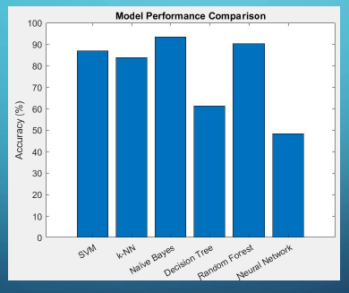
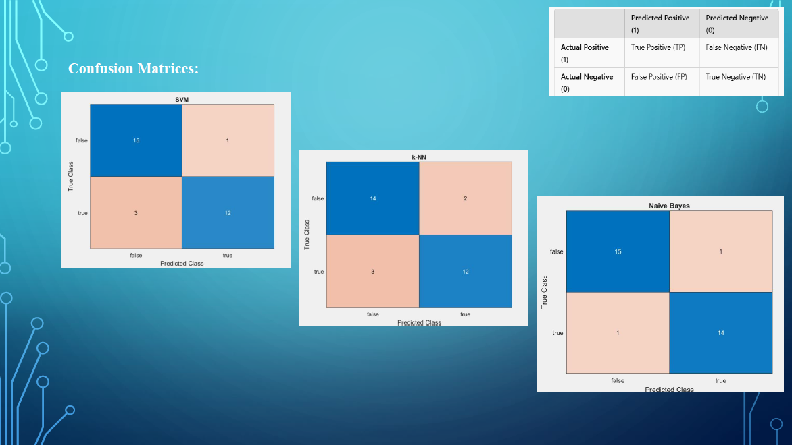

# ml-dna
E.Coli DNA promoter Sequence Classification using Machine Learning
# 🧬 DNA Sequence Classification using Machine Learning

📅 **Degree**: M.S. in Electrical and Computer Engineering
📅 **Course**: Machine Learning  
🏫 **Institution**: University at Albany, SUNY  
👨‍🏫 **Instructor**: Dr. Hany Elgala  
🧪 **Dataset**: UCI Molecular Biology – Promoter Gene Sequences  
📄 **Power_Point**: [Final Power Point (PPT)](Power_Point/DNA_Classification_PPT.pptx)

---

## 📌 Project Overview

This project focuses on binary classification of **E. coli DNA promoter sequences** using various machine learning models. Each DNA sequence has 57 nucleotide base pairs and is labeled as promoter (+) or non-promoter (−).

Key steps involved:

- Import and preprocess DNA sequences  
- Encode sequences numerically (A, C, G, T → 1, 2, 3, 4)  
- Apply stratified train-test split  
- Train six ML classifiers:  
  - Support Vector Machine (SVM)  
  - k-Nearest Neighbors (kNN)  
  - Naïve Bayes  
  - Decision Tree  
  - Random Forest  
  - Multi-Layer Perceptron (MLP)  
- Compare classifier performance and visualize confusion matrices  

---

## 📊 Model Accuracy (on test set)

| Classifier        | Accuracy |
|-------------------|----------|
| Naïve Bayes       | 90.32%   |
| k-Nearest Neighbors (kNN) | 80.65%   |
| Decision Tree     | 74.19%   |
| Random Forest     | 70.97%   |
| SVM (Linear)      | 67.74%   |
| Neural Network    | 48.39%   |

> 🔍 *Naïve Bayes achieved the highest classification accuracy.*

---

## 📈 Visualization

  
*Figure: Accuracy comparison of classifiers*

  
*Figure: Confusion matrix for Naïve Bayes classifier*

---

## 📂 File/Folder Structure

```

├── Code/ # MATLAB source code
├── assets/ # Images used in README
│ ├── model_performance_chart.png
│ ├── confusion_nb.png
├── Power_Point/
│ └── DNA_Classification_PPT.pdf
├── README.md

```
---


## 📚 References

- UCI Machine Learning Repository – Promoter Gene Sequences  
- Hahn & Valentine, *Essential MATLAB for Engineers and Scientists*  
- Class Notes – Dr. Hany Elgala, Spring 2025

---

## 📥 Downloads

- 📘 [Final Report in the form of Power Point (PPT)](Power_Point/DNA_Classification_PPT.pptx)
- 🔗 [View on GitHub](https://github.com/drsarojshah/ML_DNA_Classification)

---

## 📫 Contact

**Saroj Shah**  
✉️ [engsarojshah@gmail.com](mailto:engsarojshah@gmail.com)  
🔗 [LinkedIn](https://linkedin.com/in/saroj-s-763265226)  
🌐 [Portfolio Website](https://drsarojshah.github.io)
